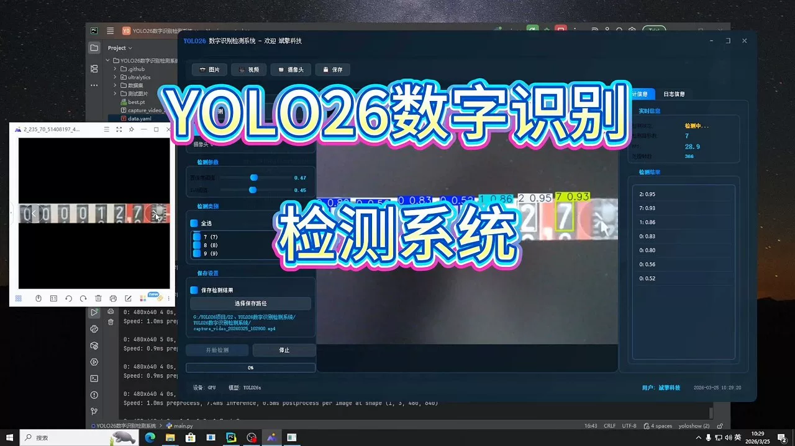
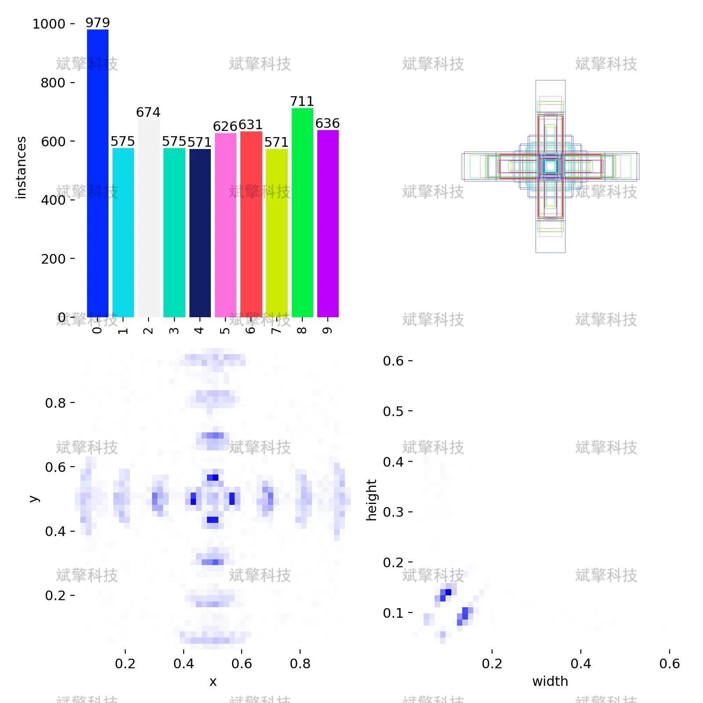
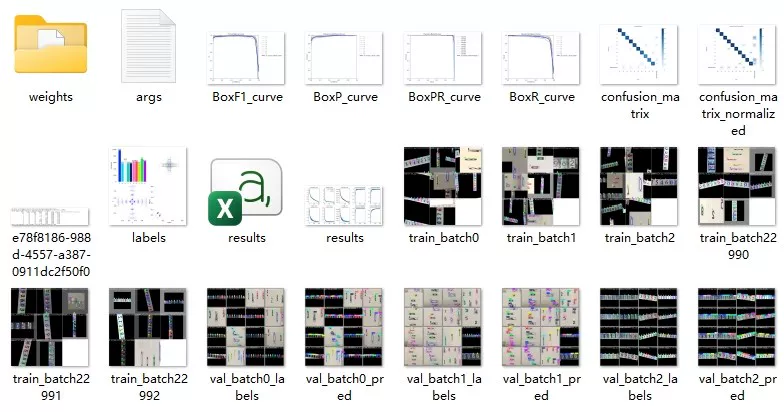
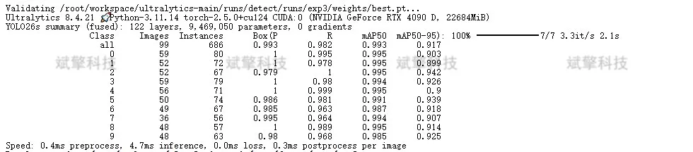
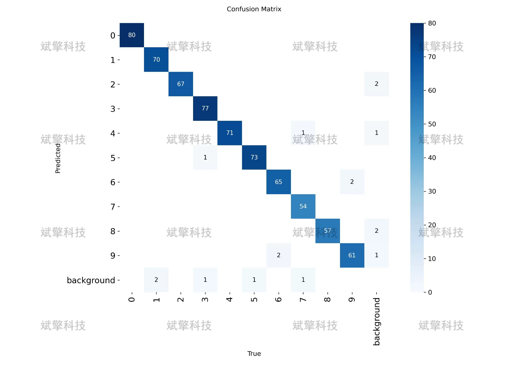
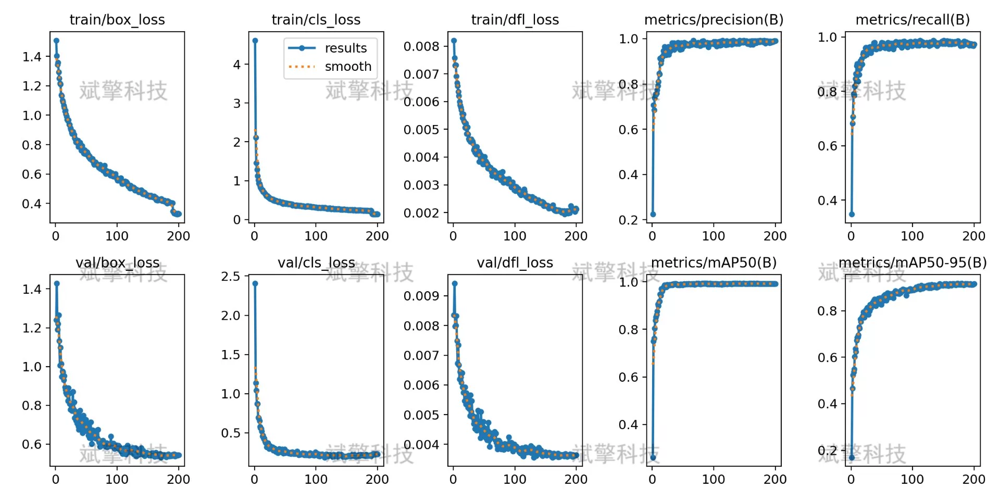
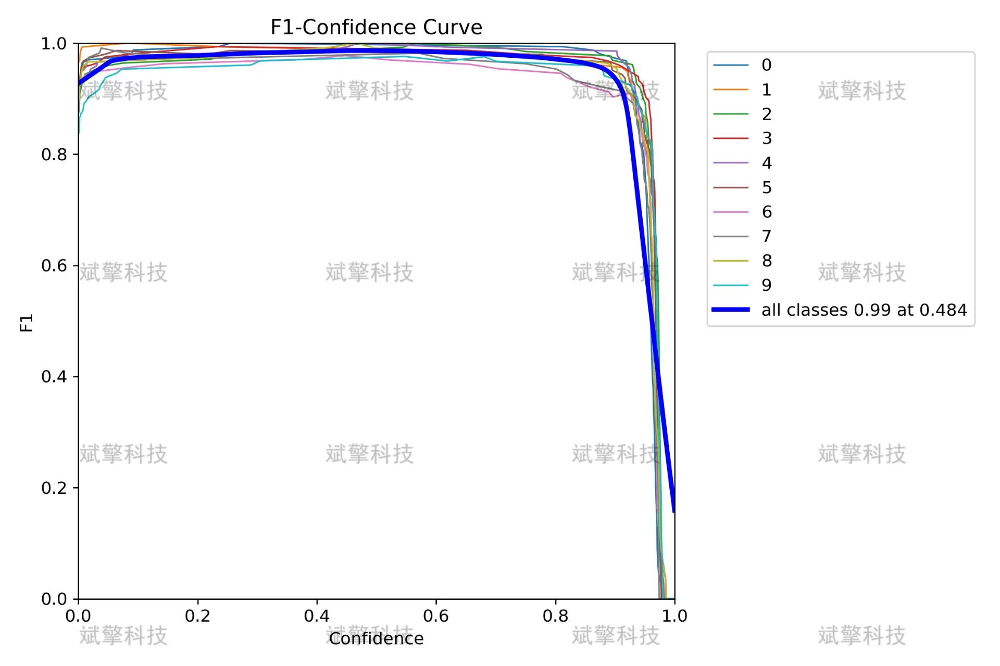
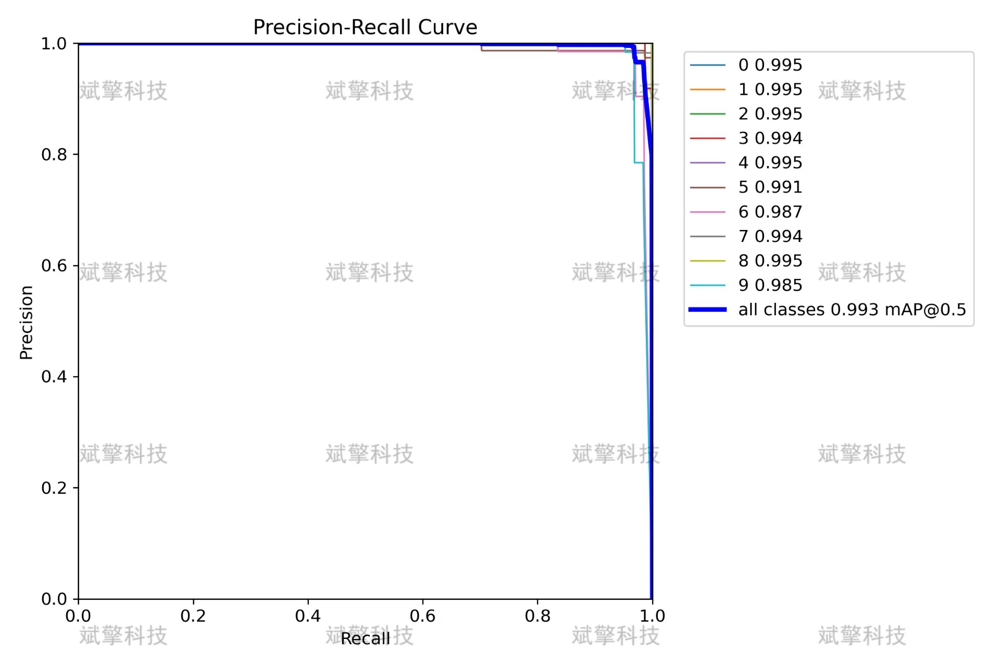
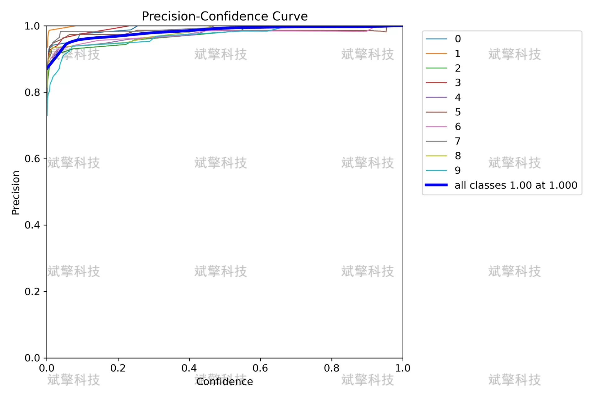

# YOLOv26 Digital Recognition Detection System | Source Code + Model

## Body

YOLO26 Digital Recognition System | Source Code + Model YOLO26 Real-World: Building a 99.3% mAP50 Digital Recognition System

This report is based on the YOLO26 object detection framework and has built a digital recognition system. The system contains 10 categories, with training sets, validation sets, and test sets respectively consisting of 966, 99, and 50 images. The model achieved excellent performance with an mAP50 of 0.993 and an mAP50-95 of 0.917 on the validation set, with precision and recall reaching 0.993 and 0.982 respectively. The confusion matrix analysis shows that the model's accuracy in recognizing various types of numbers is close to 100%, with no significant category confusion issues. During the training process, the loss function continuously decreases, and the mAP metric steadily increases, indicating that the model is well-trained and converged well. This system can achieve high recall rates at low confidence levels and maintain high precision at high confidence levels, demonstrating good practical deployment value.
The dataset includes 10 target categories corresponding to numbers 0 to 9.
Training set    966    86.6%
Validation set    99    8.9%
Test set    50    4.5%
Total    1115    100%

Free reservation for remote installation. Unsuccessful full refund.
Purchase Enjoy the following resources (auto unlock in Baidu Cloud):
     YOLO Recognition Project Complete Source Code
    ️ YOLO format datasets
      Training code + UI interface code
      Trained model + results image
      Software install package
    ️ Add WeChat reservation for remote installation (Automatically display WeChat ID after purchase) - Unsuccessful, full refund

⚙️ Core Function Modules
Detection Capability
   Image detection: upload and detect, return detection box + category information
    Video detection: supports video files, analyzes frames accurately
    Real-time camera detection: connects USB cameras to achieve dynamic monitoring
Interaction and Control
   Object selection: freely choose one or more categories for detection
   Parameter real-time adjustment: adjustable confidence threshold & IoU threshold, flexibly control precision
   Result saving: one-click save images/videos/camera detection results
System and Data
   User login registration: supports password strength detection + encryption storage
   Log recording: automatically records operation and error information (timestamped)

## Images

## Payment

Here is a pay link on Stripe ( https://buy.stripe.com/3cs8yP7sY87d0vu9AB ). Please contact me lonlonago@foxmail.com after funding $89, and I will send you a complete data files , thank you!

